# MODUL 5: Pengamanan API - Autentikasi dan Autorisasi dengan JWT

## Berikut kodingan yang saya punya
1. middleware 
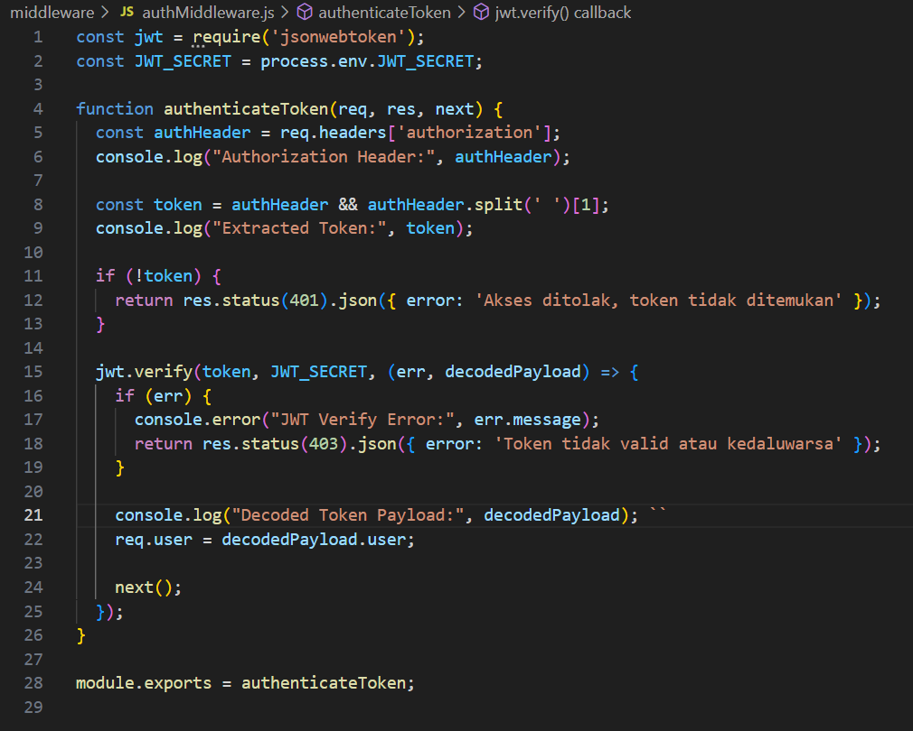
middleware  ini dugunakan untuk fungsi perantara antara request (permintaan) dari klien dan response (jawaban) dari server
2. database.js 
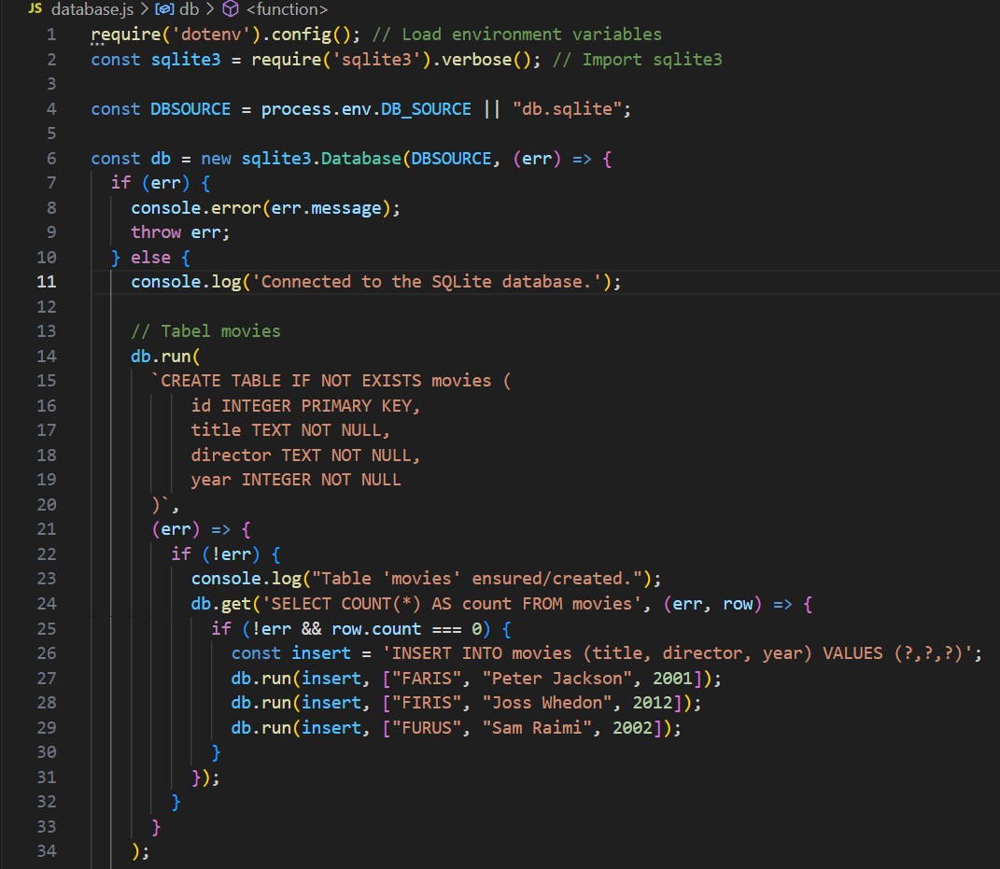
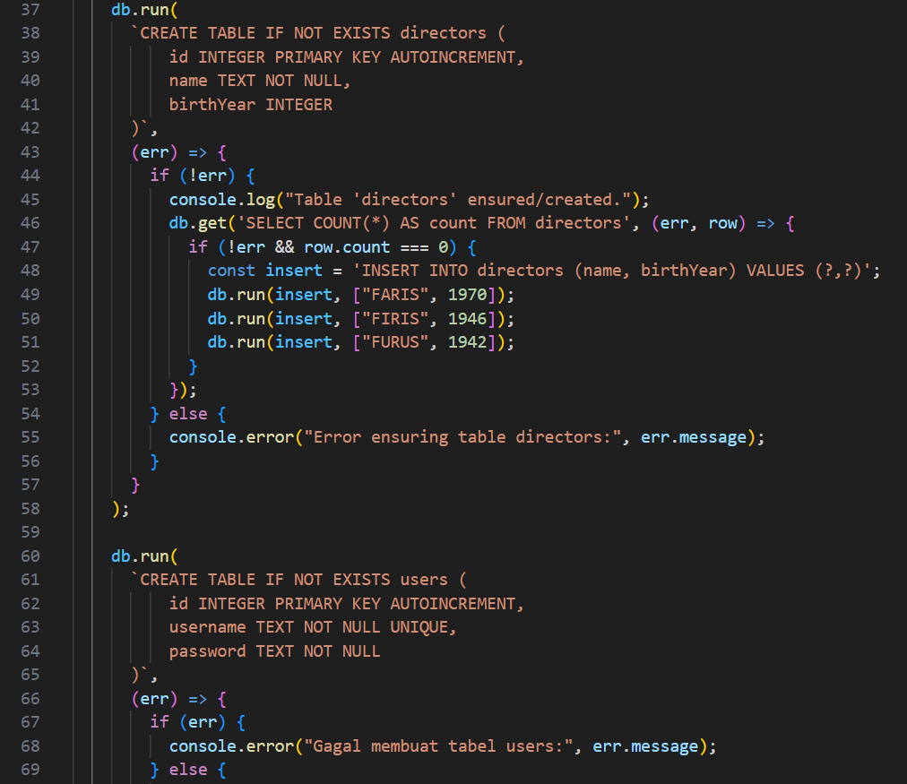
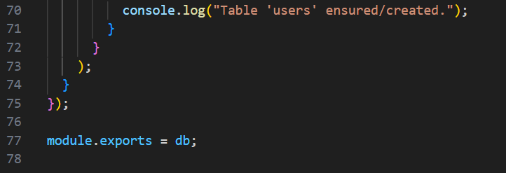
kode ini digunakan untuk menyimpan data di database
3. server.js
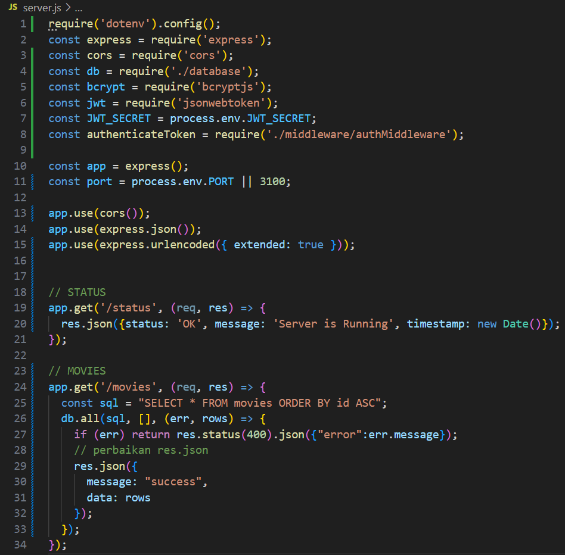
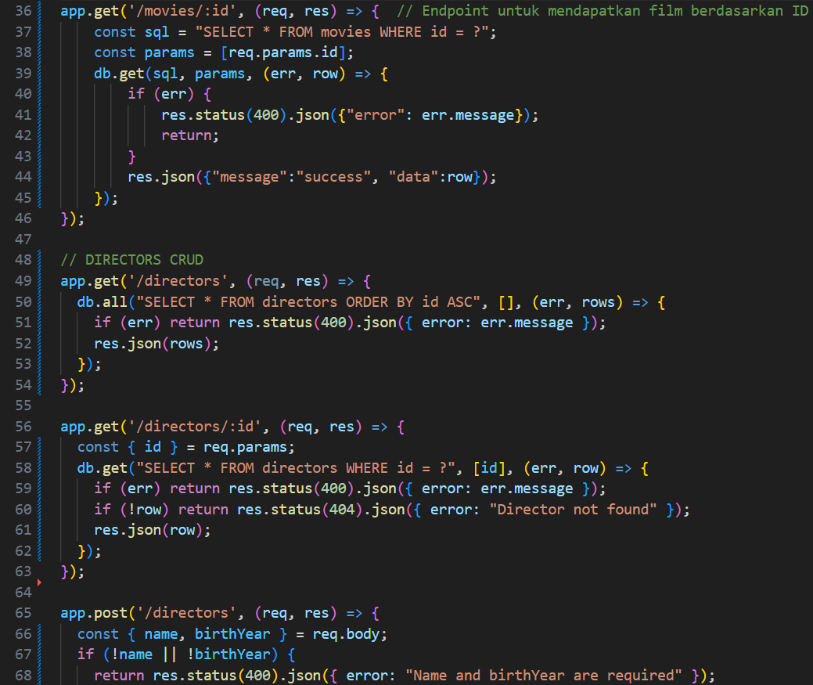
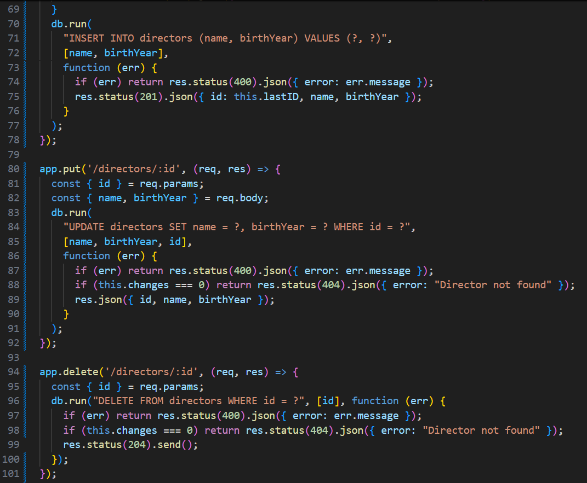
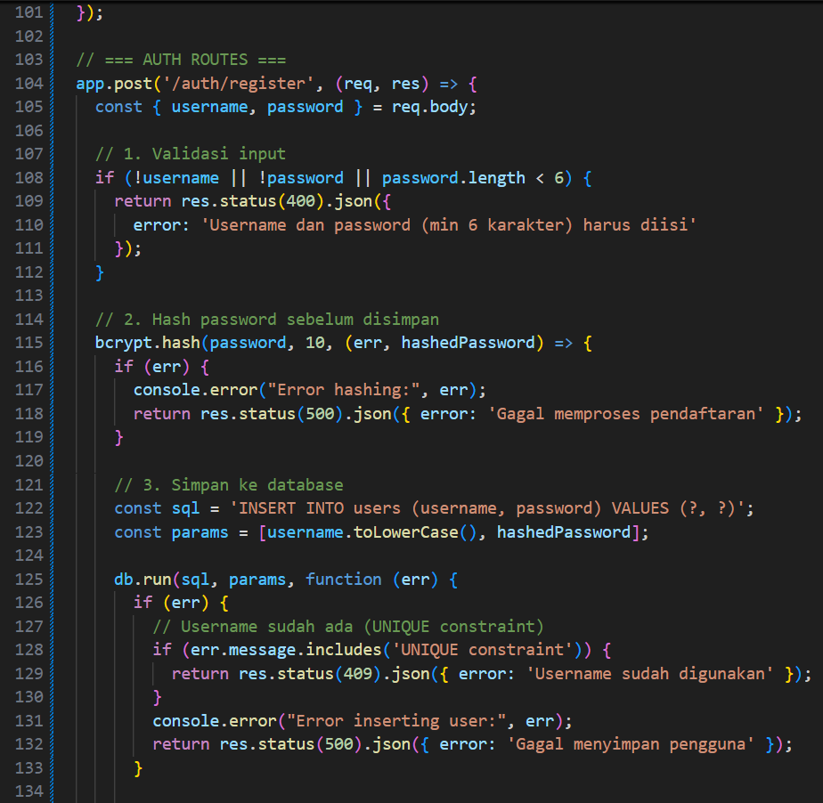
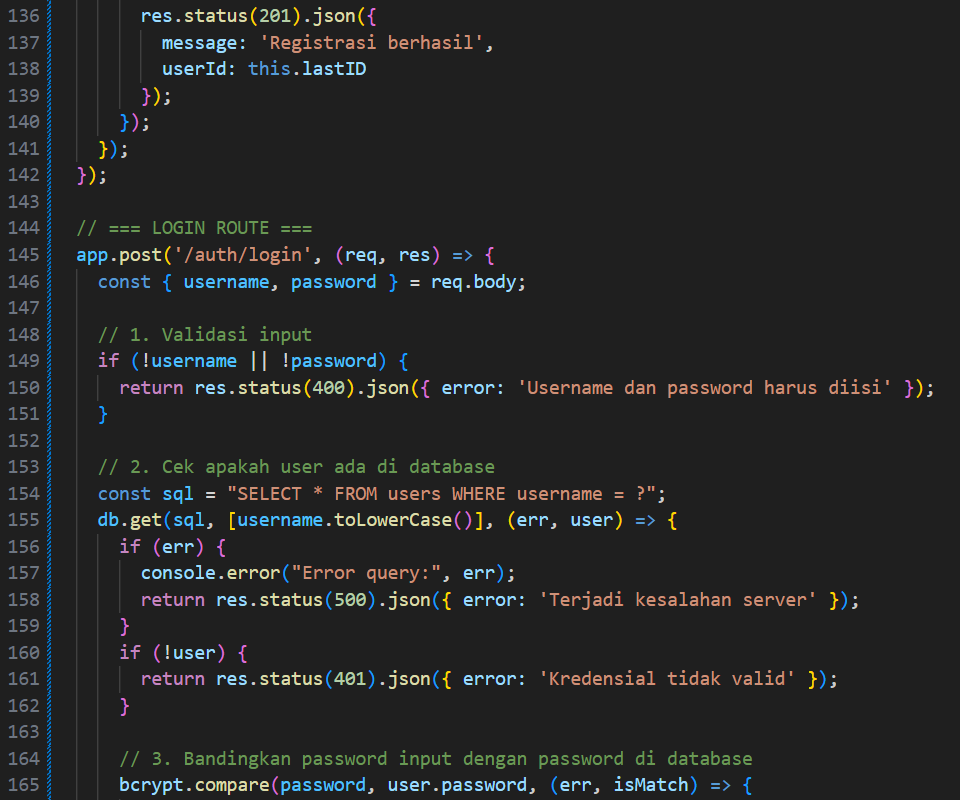
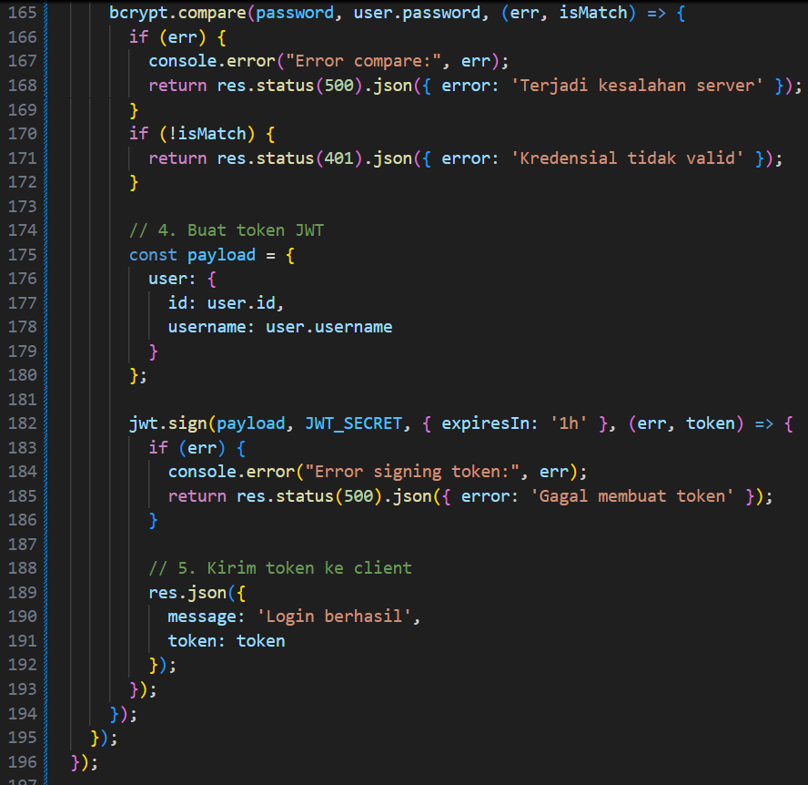
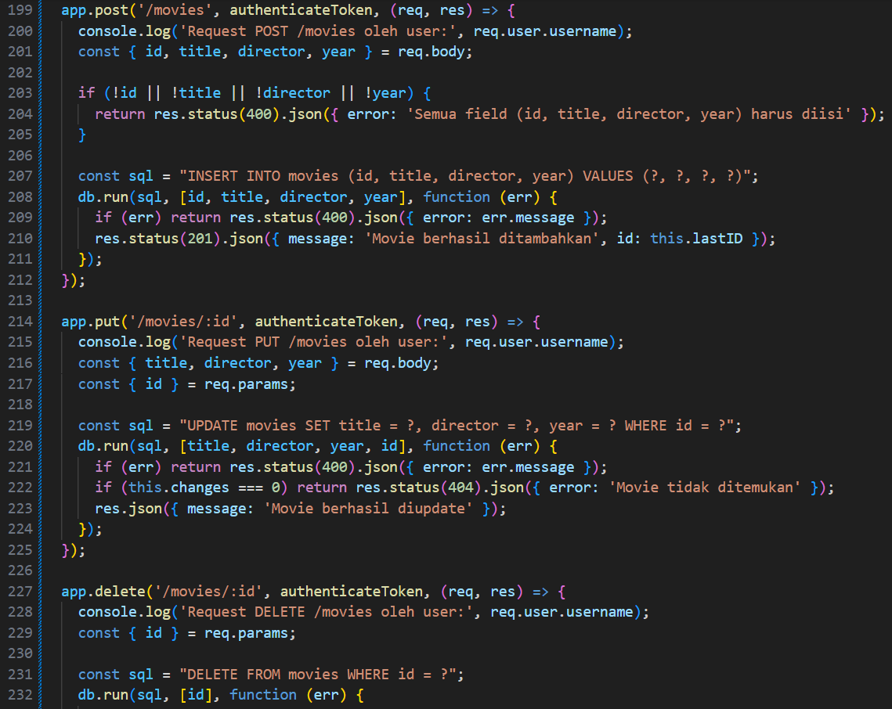
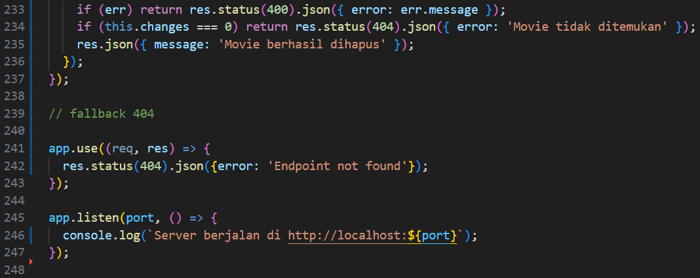
kode ini digunakan untuk titik awal (entry point) dari aplikasi Node.js saya khususnya ketika menggunakan framework Express.js.

disini saya menambahkan auth untuk Membatasi siapa yang boleh mengakses endpoint tertentu dan Melindungi data dan fitur CRUD agar hanya user yang sudah login bisa menggunakannya.

Selain itu saya juga menambahkan JWT (json web token) supaya kita dapat menerima token saat login 